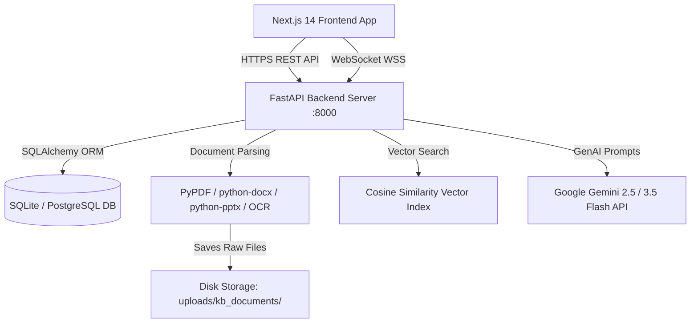
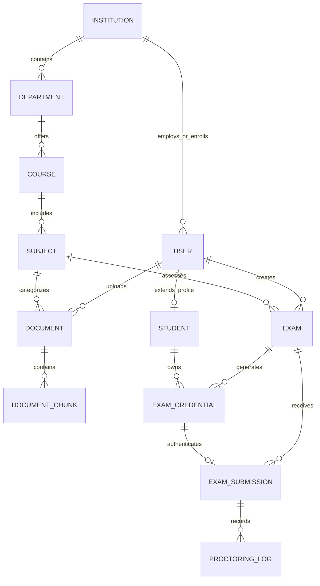

# EduQuizX — System Architecture Document

## 1. High-Level Architecture Overview

---

## 2. Technology Stack

### 2.1 Frontend
- **Framework**: Next.js 14 (App Router) with React 19 and TypeScript.
- **Styling**: TailwindCSS with CSS custom properties for warm aesthetic palette (light/dark modes).
- **Formula Rendering**: `katex` & `@types/katex` via universal `<MathText />` component.
- **State Management**: Zustand stores (`authStore.ts` with local persistence, `examStore.ts` for timer & answers autosave).
- **Icons & UI Utilities**: `lucide-react`, custom modals, toast notification provider.

### 2.2 Backend
- **Framework**: FastAPI (Python 3.9+) with async route handlers and background task workers.
- **Web Server**: Uvicorn ASGI server with live reload.
- **Database & ORM**: SQLAlchemy 2.0 with declarative base and foreign-key cascading relationships.
- **Validation**: Pydantic v2 data models & request schemas.
- **Security**: OAuth2 Password Bearer with JWT access tokens and bcrypt password hashing.
- **Real-Time Layer**: Native WebSocket endpoints for live anti-cheat telemetry streaming.

---

## 3. Database Schema & Data Models

### Key Entities:
1. **`User`**: Base identity (email, password hash, role: `teacher` | `student` | `inst_admin` | `super_admin`).
2. **`Student`**: Student profile (roll number, division, batch, department link).
3. **`Document` & `DocumentChunk`**: Uploaded learning material and segmented text chunks with vector embeddings.
4. **`Exam`**: Assessment definition, duration, total marks, passing score, schedule, and question paper JSON.
5. **`ExamCredential`**: One-time exam passcode tokens issued per student candidate.
6. **`ExamSubmission`**: Candidate score, percentage, answer selections, AI feedback, and completion status.
7. **`ProctoringLog`**: Anti-cheat events (tab switch, window blur, fullscreen exit) with timestamps.

---

## 4. API Taxonomy

| Method | Endpoint | Description |
|---|---|---|
| `POST` | `/api/v1/auth/login` | Authenticate user & issue JWT token |
| `POST` | `/api/v1/auth/forgot-password` | Password recovery trigger |
| `GET` / `POST` | `/api/v1/students/` | Manage student roster directory |
| `GET` | `/api/v1/students/assigned-exams` | Student portal active & scheduled tests feed |
| `POST` | `/api/v1/kb/upload` | Upload & chunk 100% whole file to Knowledge Base |
| `GET` | `/api/v1/kb/documents` | List indexed subject documents |
| `POST` | `/api/v1/exams/generate-from-kb` | RAG AI Assessment generator |
| `PUT` | `/api/v1/exams/{id}/questions` | Question Studio save & marks recalculation |
| `POST` | `/api/v1/exams/{id}/regenerate-question` | Single-question AI re-roll |
| `POST` | `/api/v1/exams/{id}/publish` | Publish assessment live to students |
| `POST` | `/api/v1/exams/{id}/credentials` | Generate candidate access passcodes |
| `POST` | `/api/v1/exams/{id}/end-early` | Terminate active assessment early |
| `DELETE` | `/api/v1/exams/{id}` | Cascading assessment deletion |
| `POST` | `/api/v1/attempts/login` | Candidate passcode login to exam sandbox |
| `GET` | `/api/v1/attempts/exam-info` | Fetch candidate test paper |
| `POST` | `/api/v1/attempts/save-progress` | Autosave candidate responses |
| `POST` | `/api/v1/attempts/proctor-alert` | Log anti-cheat violation event |
| `POST` | `/api/v1/attempts/submit` | Final submission & instant automated grading |
| `WS` | `/api/v1/attempts/ws/teacher/{exam_id}` | Real-time teacher proctoring event stream |
| `GET` | `/api/v1/reports/exam-analytics/{id}` | Class-wide analytics, distribution & gradebook |
| `GET` | `/api/v1/reports/my-submissions` | Historical student performance feed |
| `GET` | `/api/v1/reports/submission-detail/{id}` | Detailed question-by-question evaluation |
