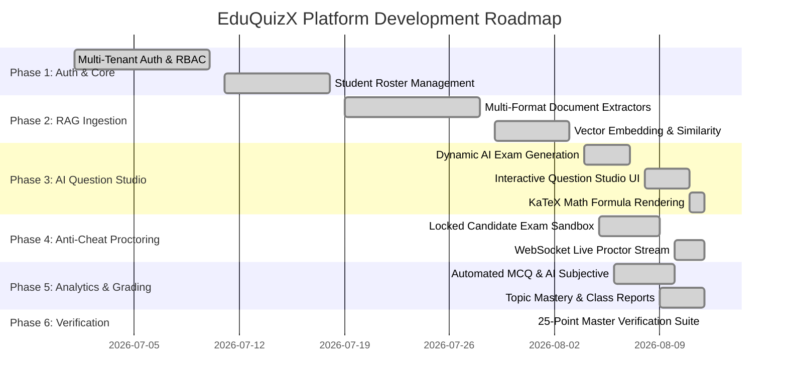

# EduQuizX — Implementation Phases & Milestones Roadmap

## Overview of Project Phases

---

## Detailed Phase Breakdown

### Phase 1: Core Foundation & Multi-Tenant Authentication
- **Status**: Completed
- **Deliverables**:
  - JWT Access Token issuance & bcrypt password hashing.
  - Role-based routing (`teacher`, `student`, `inst_admin`, `super_admin`).
  - Student roster directory management (individual creation, CSV batch import, edit, delete).
  - Password recovery gateway.

### Phase 2: RAG Knowledge Base & Multi-Format Ingestion
- **Status**: Completed
- **Deliverables**:
  - 100% whole-file parser for PDF, DOCX (including tables), PPTX (including speaker notes), TXT, and Images.
  - Multi-modal Gemini OCR for scanned papers.
  - Overlapping chunking engine and local vector store indexer.
  - Unicode surrogate sanitization.

### Phase 3: Dynamic Question Generation & AI Question Studio
- **Status**: Completed
- **Deliverables**:
  - AI question generation grounded in Knowledge Base context with strict question count control.
  - Interactive **AI Question Studio** modal in Teacher Dashboard.
  - Single-question AI re-roll endpoint (`POST /api/v1/exams/{id}/regenerate-question`).
  - Integrated `katex` with `<MathText />` for mathematical and scientific equations.
  - Printable examination paper HTML/PDF export.

### Phase 4: Secure Examination Sandbox & Anti-Cheat Proctoring
- **Status**: Completed
- **Deliverables**:
  - Candidate passcode authentication (`/attempts/login`).
  - Distraction-free exam room with full-screen enforcement, tab-switch logging, and developer tools prevention.
  - Real-time autosave progress synchronizer.
  - **Live Anti-Cheat Command Center** with WebSockets (`/api/v1/attempts/ws/teacher/{exam_id}`).
  - "End Assessment Early" gateway.

### Phase 5: Automated Grading, Learning Analytics & Reporting
- **Status**: Completed
- **Deliverables**:
  - Instant auto-grading for objective questions and AI evaluation for subjective answers.
  - AI Learning Diagnosis with personalized feedback and concept recommendations.
  - Topic-by-topic accuracy analysis and cohort leaderboards.
  - Teacher class gradebook CSV export.
  - Student Portal live assigned exams and historical review.

### Phase 6: Master System Verification & Production Hardening
- **Status**: Completed
- **Deliverables**:
  - 25-point end-to-end automated verification test suite achieving 100% pass rate.
  - Clean-slate database purge utilities.
  - All source code pushed to GitHub repository (`edgenmedia/EduQuizX`).
